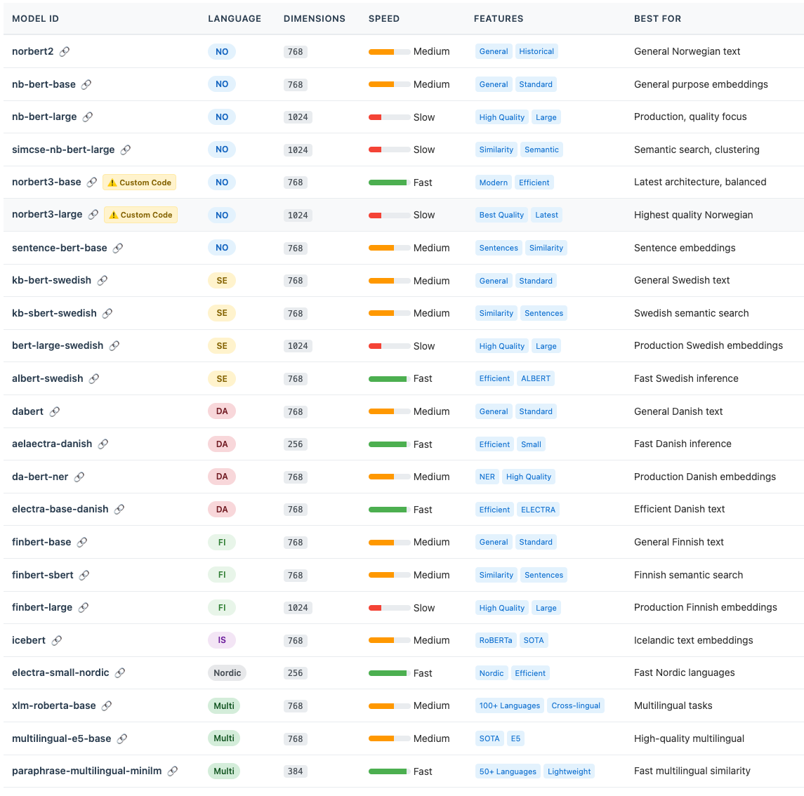
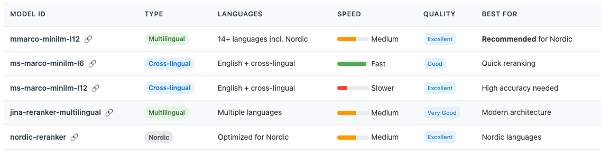

# Nordic Embedding Service (NordicEmbed)

A comprehensive embedding service running as docker container with a web dashboard for easy overview, stats and maintaince. The service supports all Nordic languages - Norwegian, Swedish, Danish, Finnish, and Icelandic - plus multilingual models for use with RAGFlow and other applications (not tested).

## Features

- ✅ Support for 23 Nordic embedding models (Norwegian, Swedish, Danish, Finnish, Icelandic)
- ✅ Complete coverage of all Nordic languages
- ✅ Multilingual models for cross-language tasks
- ✅ Autodownloading models from Huggingface
- ✅ REST API, OpenAI-compatible and compatible with RAGFlow 
- ✅ Docker containerization for easy deployment
- ✅ Web dashboard for configuration and testing
- ✅ Batch processing support
- ✅ GPU/CPU support
- ✅ Model sizes from 12M to 355M parameters
- ✅ Embedding dimensions from 256 to 1024
- ✅ **Dynamic model loading** - Models are automatically downloaded on first use
- ✅ **No pre-download required** - Start using any model immediately
- ✅ **Cross-encoder reranking** - Improve search results with neural reranking
- ✅ **5 reranking models** - Including multilingual support for Nordic languages (need more work for Ragflow compability)


## Embedding Models




## Rerank Models


(The rerank models are not fully tested in ragflow)


## Quick Start


### 1. Clone the repository
```bash
git clone <repository-url>
cd nordicembed
```

### 2. Create docker container
```bash
./rebuild.sh
```

The service should now be running, go to the dashboard at:
http://<your servers ip>:7000/

NB! Add password and api-key(s) from dashboard if your server is public accessible


## Detailed Manual Start (optional)


### 1. Clone the repository
```bash
git clone <repository-url>
cd nordicembed
```


### 2. Download models (optional - will auto-download on first use)

**Note: Models are automatically downloaded on first use!** 
You don't need to pre-download models unless you want to prepare them in advance.

```bash
# Download all models (requires ~15GB disk space for all 23 models)
python download_models.py all

# Or download specific models
python download_models.py norbert2
python download_models.py nb-bert-base nb-bert-large
python download_models.py simcse-nb-bert-large

# Download the fastest model for production
python download_models.py electra-small-nordic
```

#### Dynamic Model Downloads
- **Automatic**: When you request embeddings with a model that isn't downloaded, it will be automatically fetched from HuggingFace
- **First-time delay**: The first request to a new model will take 1-5 minutes depending on model size and internet speed
- **Cached locally**: Once downloaded, models are cached in the `./models` directory for instant loading
- **No restart needed**: New models are loaded dynamically without restarting the service


### 3. Start with Docker Compose
```bash
# Copy environment file
cp .env.example .env

# Start services
docker-compose up -d
```

The embedding service will be available at `http://localhost:7000` and the dashboard at `http://localhost:7080`.


### 4. Test the service
```bash
curl -X POST http://localhost:7000/embed \
  -H "Content-Type: application/json" \
  -d '{"texts": ["Dette er en test av den norske embedding-tjenesten."]}'
```


## Model Implementation Status

### Top 9 Norwegian Embedding Models

| # | Model ID | Full Name | Status | Embedding Dims | Model Size | Performance |
|---|----------|-----------|---------|----------------|------------|-------------|
| 1 | `norbert2` | NorBERT 2 | ✅ **Implemented** | 768 | 125M params | Excellent for general Norwegian text |
| 2 | `nb-bert-base` | NB-BERT base | ✅ **Implemented** | 768 | 110M params | Good balance of speed and quality |
| 3 | `nb-bert-large` | NB-BERT large | ✅ **Implemented** | 1024 | 340M params | Higher quality, more compute intensive |
| 4 | `simcse-nb-bert-large` | SimCSE NB-BERT Large | ✅ **Implemented** | 1024 | 340M params | Best for semantic similarity tasks |
| 5 | `norbert3-base` | NorBERT 3 base | ✅ **Implemented** | 768 | 125M params | Latest architecture, improved efficiency |
| 6 | `norbert3-large` | NorBERT 3 large | ✅ **Implemented** | 1024 | 355M params | State-of-the-art Norwegian embeddings |
| 7 | `xlm-roberta-base` | XLM-RoBERTa base | ✅ **Implemented** | 768 | 270M params | Multilingual (100+ languages) |
| 8 | `electra-small-nordic` | Nordic ELECTRA Small | ✅ **Implemented** | 256 | 14M params | Fastest inference, Nordic languages |
| 9 | `sentence-bert-base` | Sentence-BERT Norwegian | ✅ **Implemented** | 768 | 110M params | Optimized for sentence similarity |

### Additional Models (Planned)

| Model ID | Full Name | Status | Target Use Case |
|----------|-----------|---------|----------------|
| `norbert2-ner` | NorBERT 2 for NER | ⏳ Planned | Named entity recognition |
| `scandiner-bert` | ScandiNER BERT | ⏳ Planned | Entity extraction in Nordic texts |
| `norwegian-gpt2` | Norwegian GPT-2 | ⏳ Planned | Text generation embeddings |

## Available Models

### Norwegian Language Models

| Model ID | Full Name | HuggingFace Path | Description | Use Case |
|----------|-----------|------------------|-------------|----------|
| `norbert2` | NorBERT 2 | `ltg/norbert2` | Norwegian BERT model trained on diverse Norwegian text | General Norwegian embeddings, supports both Bokmål and Nynorsk |
| `nb-bert-base` | NB-BERT base | `NbAiLab/nb-bert-base` | Norwegian BERT base model by National Library of Norway | General purpose Norwegian text embeddings |
| `nb-bert-large` | NB-BERT large | `NbAiLab/nb-bert-large` | Larger Norwegian BERT model by National Library of Norway | Higher quality embeddings, more compute intensive |
| `norbert3-base` | NorBERT 3 base | `ltg/norbert3-base` | Latest NorBERT iteration, base size | Modern Norwegian text, improved performance |
| `norbert3-large` | NorBERT 3 large | `ltg/norbert3-large` | Latest NorBERT iteration, large size | Best quality Norwegian embeddings |

### Swedish Language Models

| Model ID | Full Name | HuggingFace Path | Description | Use Case |
|----------|-----------|------------------|-------------|----------|
| `kb-bert-swedish` | KB-BERT Swedish | `KB/bert-base-swedish-cased` | Swedish BERT by National Library of Sweden | General Swedish text embeddings |
| `kb-sbert-swedish` | KB-SBERT Swedish | `KBLab/sentence-bert-swedish-cased` | Swedish sentence embeddings | Semantic search and similarity in Swedish |
| `bert-large-swedish` | BERT Large Swedish | `AI-Nordics/bert-large-swedish-cased` | Large Swedish BERT model | High-quality Swedish embeddings |
| `albert-swedish` | ALBERT Swedish | `KBLab/albert-base-swedish-cased-alpha` | Swedish ALBERT model | Fast Swedish inference, efficient architecture |

### Danish Language Models

| Model ID | Full Name | HuggingFace Path | Description | Use Case |
|----------|-----------|------------------|-------------|----------|
| `dabert` | Danish BERT (DaBERT) | `Maltehb/danish-bert-botxo` | Danish BERT model by BotXO | General Danish text embeddings |
| `aelaectra-danish` | Ælæctra Danish | `Maltehb/aelaectra-danish-electra-small-cased` | Small Danish ELECTRA model | Fast Danish inference, 1/3 size of DaBERT |
| `da-bert-ner` | Danish BERT NER | `DaNLP/da-bert-ner` | Danish BERT fine-tuned for NER | High-quality Danish embeddings, entity recognition |
| `electra-base-danish` | ELECTRA Base Danish | `Maltehb/electra-base-danish-cased` | Efficient Danish ELECTRA base | Fast and efficient Danish text processing |

### Finnish Language Models

| Model ID | Full Name | HuggingFace Path | Description | Use Case |
|----------|-----------|------------------|-------------|----------|
| `finbert-base` | FinBERT Base | `TurkuNLP/bert-base-finnish-cased-v1` | Finnish BERT by TurkuNLP | General Finnish text embeddings |
| `finbert-sbert` | FinBERT SBERT | `TurkuNLP/sbert-cased-finnish-paraphrase` | Finnish sentence embeddings | Semantic search and similarity in Finnish |
| `finbert-large` | FinBERT Large | `TurkuNLP/bert-large-finnish-cased-v1` | Large Finnish BERT model | High-quality Finnish embeddings |

### Icelandic Language Model

| Model ID | Full Name | HuggingFace Path | Description | Use Case |
|----------|-----------|------------------|-------------|----------|
| `icebert` | IceBERT | `mideind/IceBERT` | Icelandic RoBERTa-base model | State-of-the-art Icelandic embeddings |

### Multilingual Nordic Models

| Model ID | Full Name | HuggingFace Path | Description | Use Case |
|----------|-----------|------------------|-------------|----------|
| `electra-small-nordic` | Nordic ELECTRA Small | `ltg/electra-small-nordic` | Small ELECTRA model for Nordic languages | Fast inference, Nordic language support |
| `xlm-roberta-base` | XLM-RoBERTa base | `xlm-roberta-base` | Multilingual model including Norwegian | Cross-lingual tasks, when mixing languages |
| `multilingual-e5-base` | Multilingual E5 Base | `intfloat/multilingual-e5-base` | State-of-the-art multilingual embeddings | High-quality cross-lingual semantic search |
| `paraphrase-multilingual-minilm` | Multilingual MiniLM | `sentence-transformers/paraphrase-multilingual-MiniLM-L12-v2` | Lightweight multilingual sentence embeddings | Fast multilingual similarity, 50+ languages |

### Sentence Similarity Models

| Model ID | Full Name | HuggingFace Path | Description | Use Case |
|----------|-----------|------------------|-------------|----------|
| `sentence-bert-base` | Sentence-BERT Norwegian | `NbAiLab/sentence-bert-base` | Sentence embeddings optimized for similarity | Semantic search, similarity matching |
| `simcse-nb-bert-large` | SimCSE NB-BERT Large | `NbAiLab/simcse-nb-bert-large` | Contrastive learning for better sentence embeddings | Advanced semantic search, clustering |

### Domain-Specific Models

| Model ID | Full Name | HuggingFace Path | Description | Use Case |
|----------|-----------|------------------|-------------|----------|
| `norbert2-ner` | NorBERT 2 for NER | `ltg/norbert2-ner` | Fine-tuned for named entity recognition | When working with entity-heavy texts |
| `scandiner-bert` | ScandiNER BERT | `saattrupdan/scandiner-bert` | Nordic NER-optimized model | Entity extraction in Nordic texts |

## Model Management

### Dynamic Model Loading

NoEmbed features intelligent model management that makes it easy to work with multiple models:

1. **Automatic Downloads**: When you use the test endpoint or API with a model that hasn't been downloaded yet, NoEmbed will automatically download it from HuggingFace.

2. **Progress Indication**: During download, the service remains responsive. The first request to a new model will take longer (1-5 minutes depending on model size).

3. **Persistent Storage**: Downloaded models are saved to the `./models` directory and persist across container restarts.

4. **Memory Efficient**: Only the actively used model is loaded into memory. When switching models via the test endpoint, the previous model is unloaded.

5. **No Configuration Needed**: Simply specify the model name in your API request or test interface - NoEmbed handles the rest.

### Storage Requirements

Model sizes vary significantly:
- **Small models** (ALBERT, ELECTRA small): ~50-200MB
- **Base models** (BERT base): ~500MB
- **Large models** (BERT large): ~1.3GB
- **All 23 models**: ~15GB total

### Example: Using a New Model

```bash
# First use of a model - will auto-download
curl -X POST http://localhost:7000/api/test-embed \
  -H "Content-Type: application/json" \
  -d '{
    "texts": ["Hej från Sverige!"],
    "model": "bert-large-swedish"
  }'
# Note: First request will take 2-3 minutes to download the model
# Subsequent requests will be instant
```

## Model Selection Guide

### Recommended Models by Use Case

1. **General Purpose Norwegian Embeddings**
   - First choice: `norbert2` - Well-balanced performance and quality
   - Alternative: `nb-bert-base` - Good performance, widely tested

2. **High-Quality Semantic Search**
   - First choice: `simcse-nb-bert-large` - Best for similarity tasks
   - Alternative: `norbert3-large` - Latest model with excellent quality

3. **Fast Inference / Production**
   - First choice: `norbert3-base` - Modern architecture, good speed
   - Alternative: `electra-small-nordic` - Fastest option

4. **Multilingual Applications**
   - First choice: `xlm-roberta-base` - Supports 100+ languages including Nordic languages
   - Alternative: `electra-small-nordic` - Nordic languages focus

5. **Domain-Specific Tasks**
   - Entity extraction: `norbert2-ner` or `scandiner-bert`
   - Historical Norwegian text: `norbert2` (trained on diverse sources)

### Model Performance Comparison

| Model | Language | Embedding Dimensions | Model Size | Typical Speed (GPU) | Memory Usage (GPU) |
|-------|----------|---------------------|------------|-------------------|-------------------|
| **Norwegian Models** |
| `norbert2` | NO | 768 | 125M | ~50ms/batch | ~500MB |
| `nb-bert-base` | NO | 768 | 110M | ~50ms/batch | ~450MB |
| `nb-bert-large` | NO | 1024 | 340M | ~100ms/batch | ~1.4GB |
| `simcse-nb-bert-large` | NO | 1024 | 340M | ~100ms/batch | ~1.4GB |
| `norbert3-base` | NO | 768 | 125M | ~40ms/batch | ~500MB |
| `norbert3-large` | NO | 1024 | 355M | ~90ms/batch | ~1.5GB |
| `sentence-bert-base` | NO | 768 | 110M | ~50ms/batch | ~450MB |
| **Swedish Models** |
| `kb-bert-swedish` | SE | 768 | 125M | ~50ms/batch | ~500MB |
| `kb-sbert-swedish` | SE | 768 | 125M | ~50ms/batch | ~500MB |
| `bert-large-swedish` | SE | 1024 | 340M | ~100ms/batch | ~1.4GB |
| `albert-swedish` | SE | 768 | 12M | ~30ms/batch | ~200MB |
| **Danish Models** |
| `dabert` | DA | 768 | 125M | ~50ms/batch | ~500MB |
| `aelaectra-danish` | DA | 256 | 13M | ~15ms/batch | ~80MB |
| `da-bert-ner` | DA | 768 | 125M | ~50ms/batch | ~500MB |
| `electra-base-danish` | DA | 768 | 110M | ~40ms/batch | ~450MB |
| **Finnish Models** |
| `finbert-base` | FI | 768 | 125M | ~50ms/batch | ~500MB |
| `finbert-sbert` | FI | 768 | 125M | ~50ms/batch | ~500MB |
| `finbert-large` | FI | 1024 | 340M | ~100ms/batch | ~1.4GB |
| **Icelandic Model** |
| `icebert` | IS | 768 | 125M | ~50ms/batch | ~500MB |
| **Multilingual Nordic** |
| `xlm-roberta-base` | Multi | 768 | 270M | ~60ms/batch | ~1.1GB |
| `electra-small-nordic` | Nordic | 256 | 14M | ~20ms/batch | ~100MB |
| `multilingual-e5-base` | Multi | 768 | 280M | ~65ms/batch | ~1.2GB |
| `paraphrase-multilingual-minilm` | Multi | 384 | 118M | ~35ms/batch | ~480MB |

## Reranking Models

NoEmbed includes support for cross-encoder reranking models to improve search results quality. Rerankers score the relevance between queries and documents, allowing you to reorder search results for better accuracy.

### Available Reranking Models

| Model ID | Description | Language Support | Speed | Use Case |
|----------|-------------|------------------|-------|----------|
| `mmarco-minilm-l12` | Multilingual MS-MARCO MiniLM | 14+ languages including Nordic | Medium | **Recommended** for Nordic languages |
| `ms-marco-minilm-l6` | English MS-MARCO MiniLM L6 | English (works cross-lingually) | Fast | Quick reranking, decent multilingual |
| `ms-marco-minilm-l12` | English MS-MARCO MiniLM L12 | English (works cross-lingually) | Slower | High quality reranking |
| `jina-reranker-multilingual` | Jina AI Reranker v2 | Multilingual | Medium | Modern architecture, good accuracy |
| `nordic-reranker` | Nordic-optimized reranker | Nordic languages | Medium | Alias for mmarco-minilm-l12 |

### Reranking API Usage

#### Rerank Documents
```bash
curl -X POST http://localhost:7000/api/rerank \
  -H "Content-Type: application/json" \
  -d '{
    "query": "Hva er hovedstaden i Norge?",
    "documents": [
      "Oslo er hovedstaden i Norge og landets største by.",
      "Bergen er Norges nest største by.",
      "Hovedstaden i Sverige er Stockholm.",
      "Trondheim var Norges hovedstad i middelalderen."
    ],
    "model": "mmarco-minilm-l12",
    "top_k": 3
  }'
```

#### Score Query-Document Pairs
```bash
curl -X POST http://localhost:7000/api/score-pairs \
  -H "Content-Type: application/json" \
  -d '{
    "pairs": [
      ["Hvad er Danmarks hovedstad?", "København er Danmarks hovedstad."],
      ["Hvad er Danmarks hovedstad?", "Aarhus er Danmarks næststørste by."]
    ],
    "model": "mmarco-minilm-l12"
  }'
```

### When to Use Reranking

1. **Improving Search Results**: After retrieving documents with embeddings, use reranking to improve the order based on query relevance
2. **Cross-lingual Search**: Rerankers can handle queries in one language and documents in another
3. **High-stakes Search**: When accuracy is more important than speed
4. **Small Result Sets**: Reranking works best on 10-100 documents

### Two-Stage Retrieval Example

Here's how to combine embeddings and reranking for optimal results:

```python
# Step 1: Retrieve top 50 candidates using embeddings
response = requests.post("http://localhost:7000/api/embed", 
    json={"texts": [query]})
query_embedding = response.json()["embeddings"][0]

# Search your vector database for top 50 similar documents
candidates = vector_db.search(query_embedding, top_k=50)

# Step 2: Rerank top 50 to get best 10
rerank_response = requests.post("http://localhost:7000/api/rerank",
    json={
        "query": query,
        "documents": [doc.text for doc in candidates],
        "model": "mmarco-minilm-l12",
        "top_k": 10
    })

# Final results are reranked by relevance
final_results = rerank_response.json()["results"]
```

### Reranking Performance

- **Latency**: 50-200ms for 10 documents (depending on model and hardware)
- **Accuracy**: Significantly improves search relevance, especially for Nordic languages
- **Memory**: Each reranker uses 200-500MB of RAM

## Configuration

Set environment variables in `.env`:

```env
# Model selection (see Available Models section above)
MODEL_NAME=norbert2          # Default: norbert2

# Server configuration
HOST=0.0.0.0                # Server host
PORT=7000                   # Server port
WORKERS=1                   # Number of workers

# Performance settings
DEVICE=cuda                 # cpu or cuda (GPU recommended)
MAX_BATCH_SIZE=32           # Maximum texts per request
MAX_LENGTH=512              # Maximum token length

# Logging
LOG_LEVEL=INFO              # DEBUG, INFO, WARNING, ERROR

# Security
ALLOW_TRUST_REMOTE_CODE=true # Allow models with custom code (required for norbert3)
```

### Reranking Configuration

Reranking models are loaded dynamically when used. You can configure default behavior:

```env
# Default reranker model
DEFAULT_RERANKER=mmarco-minilm-l12  # Recommended for Nordic languages

# Reranking settings
RERANK_MAX_LENGTH=512       # Maximum token length for reranking
RERANK_BATCH_SIZE=32        # Maximum documents per reranking request
```

#### Available Reranker Models
- `mmarco-minilm-l12` - **Recommended**: Multilingual, excellent for Nordic
- `ms-marco-minilm-l6` - Fast English reranker (cross-lingual capable)
- `ms-marco-minilm-l12` - High quality English reranker
- `jina-reranker-multilingual` - Modern multilingual reranker
- `nordic-reranker` - Alias for mmarco-minilm-l12, optimized naming

### Changing Models

To use a different model, update the `MODEL_NAME` in your `.env` file:

```env
# For semantic search
MODEL_NAME=simcse-nb-bert-large

# For fast inference
MODEL_NAME=electra-small-nordic

# For multilingual support
MODEL_NAME=xlm-roberta-base
```

Then restart the service:
```bash
docker-compose restart embed-nordic
```

**Note**: The first time you use a new model, it will be downloaded from HuggingFace (can take several minutes).

## API Documentation

### POST /embed
Generate embeddings for text.

**Request:**
```json
{
  "texts": ["Text 1", "Text 2", "..."]
}
```

**Response:**
```json
{
  "embeddings": [[0.1, 0.2, ...], [0.3, 0.4, ...], ...]
}
```

### GET /health
Check service health.

### GET /
Get service information.

### POST /api/rerank
Rerank documents based on query relevance using cross-encoder models.

**Request:**
```json
{
  "query": "Search query",
  "documents": ["Document 1", "Document 2", "..."],
  "model": "mmarco-minilm-l12",  // optional, defaults to mmarco-minilm-l12
  "top_k": 5  // optional, return only top K results
}
```

**Response:**
```json
{
  "results": [
    {
      "index": 0,         // original document index
      "score": 0.9876,    // relevance score
      "document": "Document text..."
    },
    // ... more results
  ],
  "model": "mmarco-minilm-l12",
  "query_length": 25,
  "documents_count": 10
}
```

### POST /api/score-pairs
Score query-document pairs for relevance.

**Request:**
```json
{
  "pairs": [
    ["query 1", "document 1"],
    ["query 2", "document 2"]
  ],
  "model": "mmarco-minilm-l12"  // optional
}
```

**Response:**
```json
{
  "scores": [0.9876, 0.5432],
  "model": "mmarco-minilm-l12"
}
```

## OpenAI-Compatible API

NoEmbed provides OpenAI-compatible endpoints for easy integration with RAGFlow and other tools.

### Base URL
```
http://your-server:7000/v1/
```

### Available Endpoints

#### List Models
```bash
curl http://localhost:7000/v1/models
```

#### Embeddings
```bash
curl -X POST http://localhost:7000/v1/embeddings \
  -H "Content-Type: application/json" \
  -d '{
    "model": "norbert2",
    "input": "Dette er en test"
  }'
```

#### Reranking
```bash
curl -X POST http://localhost:7000/v1/rerank \
  -H "Content-Type: application/json" \
  -d '{
    "model": "mmarco-minilm-l12",
    "query": "Hva er hovedstaden i Norge?",
    "documents": [
      "Oslo er hovedstaden i Norge.",
      "Bergen er Norges nest største by."
    ],
    "top_n": 5
  }'
```

### RAGFlow Configuration

To use with RAGFlow, set your base URL to:
```
http://your-server:7000/v1/
```

The service will automatically route requests to the appropriate model type (embedding or reranking) based on the model name.

### Common Issues

#### "Model is a reranking model" Error
If you get an error like `Model 'mmarco-minilm-l12' is a reranking model`, you're using the wrong endpoint:
- **Embedding models** → Use `/v1/embeddings`
- **Reranking models** → Use `/v1/rerank`

To check which type a model is:
```bash
curl http://localhost:7000/v1/models | jq '.data[] | select(.id=="mmarco-minilm-l12")'
```

Look for the `type` field: `"type": "reranking"` or `"type": "embedding"`

Or use the helper script:
```bash
python check_model_type.py mmarco-minilm-l12
# Shows: Type: reranking, Use endpoint: POST /v1/rerank

python check_model_type.py norbert2  
# Shows: Type: embedding, Use endpoint: POST /v1/embeddings
```

## RAGFlow Integration

See [ragflow_config_guide.md](ragflow_config_guide.md) for complete RAGFlow configuration instructions.

### Quick Setup for RAGFlow

#### For Embedding Models (Knowledge Base)
1. Add OpenAI-Compatible provider with base URL: `http://your-server:7000/v1`
2. Select embedding model when creating Knowledge Base: `norbert2`, `multilingual-e5-base`, etc.

#### For Reranking Models (Agent Workflow)
1. Edit `conf/llm_factories.json` to add reranking models (see guide)
2. Configure with base URL: `http://your-server:7000/rerank`
3. Restart RAGFlow and select reranker in Agent's Retrieval component

### Supported Models for RAGFlow

✅ **Embedding models** (for Knowledge Base):
- `norbert2`, `nb-bert-base`, `nb-bert-large` (Norwegian)
- `kb-bert-swedish`, `bert-large-swedish` (Swedish)  
- `dabert`, `aelaectra-danish` (Danish)
- `finbert-base`, `finbert-sbert` (Finnish)
- `icebert` (Icelandic)
- `multilingual-e5-base`, `xlm-roberta-base` (Multilingual)

✅ **Reranking models** (for Agent Retrieval):
- Configure in `llm_factories.json` with `/rerank` endpoint
- Available: `mmarco-minilm-l12`, `ms-marco-minilm-l6`, etc.

**Error "102"?** You're trying to use a reranking model as an embedding model. See the [configuration guide](ragflow_config_guide.md).

## Development

### Local Development
```bash
# Install dependencies
pip install -r requirements.txt

# Run locally
python main.py
```

### Testing All Models
```bash
# Test that all 9 models can be loaded and generate embeddings
python test_models.py

# This will:
# - Load each model (auto-downloading if needed)
# - Generate embeddings for sample texts
# - Verify embedding dimensions
# - Report success/failure for each model
```

### Building Docker Image
```bash
docker build -t embed-nordic .
```

## Performance Optimization

- **GPU Support**: Set `DEVICE=cuda` in environment
- **Batch Processing**: Send multiple texts in one request (up to MAX_BATCH_SIZE)
- **Model Selection**: Use `norbert3-base` for faster inference

## Troubleshooting

### Service won't start
- Check logs: `docker-compose logs embed-nordic`
- Ensure port 7000 is not in use
- Verify model files exist in `./models`

### Out of memory errors
- Reduce `MAX_BATCH_SIZE`
- Use smaller model (`norbert3-base`)
- Ensure sufficient RAM/VRAM

### Slow performance
- Enable GPU: `DEVICE=cuda`
- Reduce `MAX_LENGTH`
- Use batch requests

## License

This project is licensed under the MIT License.

## Acknowledgments

- [NorBERT models](https://github.com/ltgoslo/norbert2) by Language Technology Group, University of Oslo
- [SimCSE-NB-BERT](https://huggingface.co/FFI/SimCSE-NB-BERT-large) by FFI